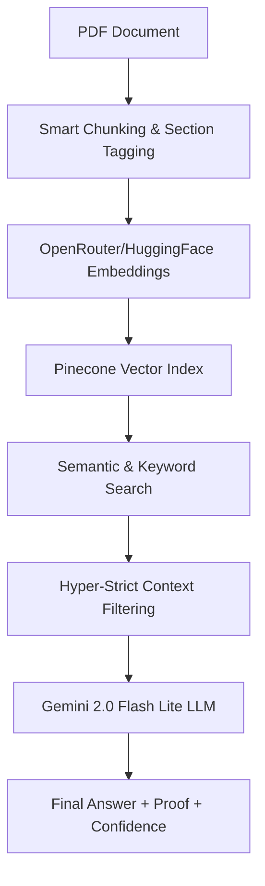

# 🛡️ Annual Report AI: Premium RAG Intelligence

[](https://www.python.org/downloads/)
[](https://streamlit.io/)
[](https://www.pinecone.io/)
[](https://opensource.org/licenses/MIT)

A **production-grade, stealth-themed RAG (Retrieval-Augmented Generation)** dashboard designed for deep financial analysis. This system transforms complex Annual Reports into interactive, evidence-backed insights with zero hallucinations.

---

## ✨ Premium Features

### 🎨 Cyberpunk Analyst UI
- **Stealth Aesthetic**: A professional dark-mode interface with glassmorphism and pulsing neon accents.
- **Dynamic Header**: Features a pulsing 🛡️ Shield Logo and a glowing gradient separator.
- **Responsive Layout**: Optimized for high-density financial data viewing.

### 🧠 Smart Grounding Engine
- **Automatic Page Calibration**: Intelligent mapping that syncs PDF internal pages with the physical **Printed Page Numbers** of the report.
- **Hyper-Strict Evidence Filtering**: A precision-weighted filter that eliminates "noise" and only shows evidence directly relevant to your query.
- **Fact-Density Scoring**: A sophisticated confidence engine that evaluates proper nouns, financial terms, and multi-source consensus.

### 📄 Transparent Auditing
- **Persistent Evidence (Proof)**: High-visibility expanders that stay pinned to your chat history, showing full-paragraph context.
- **Interactive Citations**: Direct links to specific sections and verified printed page numbers.
- **Color-Coded Reliability**: 🟢 High Accuracy, 🟡 Moderate, and 🔴 Low-Confidence (Verify) indicators.

---

## 🏗️ Technical Architecture



---

## 🛠️ Tech Stack

| Component | Technology |
|---|---|
| **Frontend** | Streamlit (Custom CSS/HTML Injection) |
| **Orchestration** | LangChain |
| **Vector DB** | Pinecone |
| **LLM** | Google Gemini 2.5 Flash via OpenRouter |
| **Embeddings** | Sentence-Transformers / OpenAI |
| **PDF Processing** | PyPDF |

---

## 📂 Project Structure

```bash
Annual-Report-RAG/
├── src/
│   ├── chunking.py          # Intent-aware section tagging
│   ├── config.py            # Dynamic environment loader
│   ├── embeddings.py        # Vector embedding generation
│   ├── pdf_loader.py        # Metadata-preserving PDF parser
│   ├── pinecone_store.py    # Vector cloud synchronization
│   └── rag_chain.py         # The RAG "Brain"
├── app.py                   # Premium UI & Dashboard Logic
├── .gitignore               # Security & Size protection
└── requirements.txt         # Dependency tree
```

---

## ⚙️ Installation & Setup

1. **Clone & Enter**
   ```bash
   git clone https://github.com/Krush2004/Annual-Report-RAG-System.git
   cd Annual-Report-RAG-System
   ```

2. **Environment Configuration**
   Create a `.env` file in the root:
   ```env
   OPENROUTER_API_KEY=your_key
   PINECONE_API_KEY=your_key
   PINECONE_INDEX=annual-report-v3
   ```

3. **Launch the Dashboard**
   ```bash
   pip install -r requirements.txt
   streamlit run app.py
   ```

---

## 🛡️ Security Note
This project includes a strict `.gitignore` to prevent the accidental upload of private API keys (`.env`) or internal company PDFs. **Always verify your secrets before pushing!**

---

*Developed by [Krush2004](https://github.com/Krush2004)*
